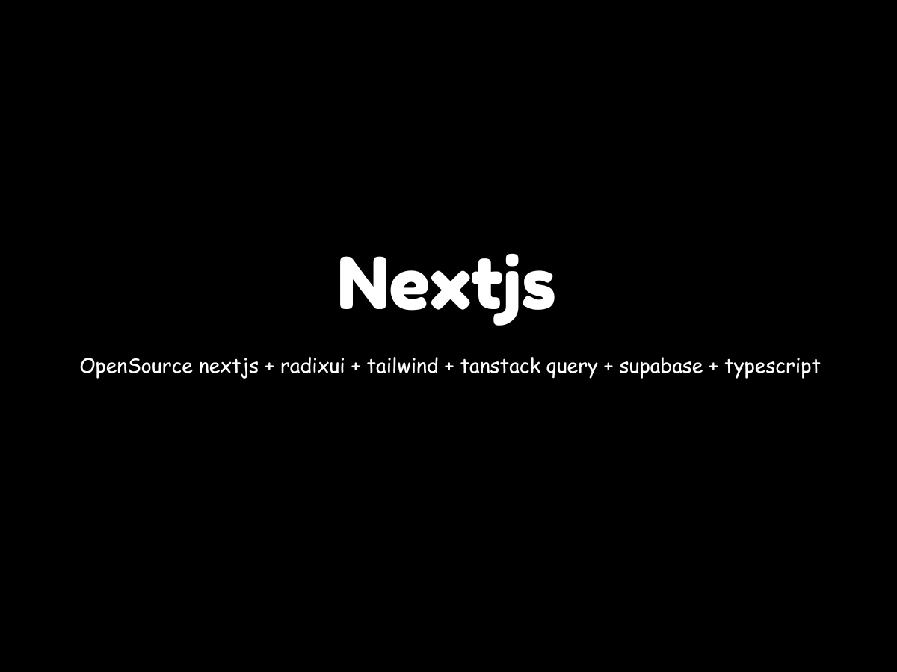

<h1 align="center">
  Next Todo
</h1>
<p align="center">
  Opensource nextjs, radixui, tailiwnd, tanstack query, supabase, typescript
</p>



## Live Preview

[Next Todo](https://next-todo-ashen-six.vercel.app/)

## Tech Stack

- [Next.js](https://nextjs.org) - React framework for building performant apps with the best developer experience.
- [TypeScript](https://typescriptlang.org) - Static type checker for end-to-end typesafety.
- [Tailwind CSS](https://tailwindcss.com) - Utility-first CSS framework for rapid UI development.
- [Radix UI](https://www.radix-ui.com/) - Primitives like drawer, button, etc. to build a stellar user experience.
- [Tanstack Query](https://tanstack.com/query/latest) - Powerful asynchronous state management for TS/JS, React, Solid, Vue, Svelte and Angular.
- [Supabase](https://supabase.com/) - Supabase is an open source Firebase alternative.

## Running Locally

### Setting Supabase

#### Sql tabel
```sql
-- Create category table
CREATE TABLE IF NOT EXISTS public.category (
    id uuid NOT NULL DEFAULT uuid_generate_v4() PRIMARY KEY, -- Add PRIMARY KEY
    name TEXT NOT NULL
);

-- Insert some sample data into the category table
INSERT INTO category (name)
VALUES
    ('todo'),
    ('doing'),
    ('done');

-- Enable row-level security for the category table
ALTER TABLE category ENABLE ROW LEVEL SECURITY;

-- Create todo table
CREATE TABLE IF NOT EXISTS public.todo (
    id uuid NOT NULL DEFAULT uuid_generate_v4() PRIMARY KEY,
    title VARCHAR NOT NULL,
    image VARCHAR NOT NULL,
    description VARCHAR NOT NULL,
    category_id uuid REFERENCES category(id), -- Reference the primary key
    is_completed BOOLEAN DEFAULT FALSE,
    created_at TIMESTAMP WITH TIME ZONE NOT NULL DEFAULT NOW(),
    updated_at TIMESTAMP WITH TIME ZONE NOT NULL DEFAULT NOW()
);
```

<b> Results </b><br>


#### Create Policy Table


#### [Create Storage](https://supabase.com/docs/guides/storage)

<b> Policy Storage </b><br>


### Settting .env.local

```bash
NEXT_PUBLIC_SUPABASE_URL=
NEXT_PUBLIC_SUPABASE_ANON_KEY=
NEXT_PUBLIC_SUPABASE_BUCKET_NAME=
BASE_URL=
```

### Command

```bash
$ git clone https://github.com/geriadam/next-todo.git
$ cd next-todo
$ npm install
$ npm run dev
```
